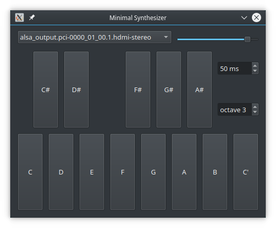

# Minimalist Music Synthesizer for Qt

This project is a proof of concept, and a minimalist multiplatform music [monosynth](https://en.wikipedia.org/wiki/Polyphony_and_monophony_in_instruments#Monophonic) prototype, using Qt Multimedia audio output. The synthesizer generates simple sine wave tones, which sound both dry and harsh, so they are not very useful for actual musical applications, except maybe for building a crude tuner.

The synth is implemented in the `ToneSynthesizer` class, that expects an `AudioFormat` defining floating point samples, a single channel (mono), and a sample rate of 44100 Hz (very typical specifications). The 13 precomputed note frequencies reside on a table initialized with an [equal temperament](https://en.wikipedia.org/wiki/Equal_temperament#Twelve-tone_equal_temperament) chromatic scale. The notes may be transposed from octave 0 to octave 9 in [scientific pitch notation](https://en.wikipedia.org/wiki/Scientific_pitch_notation) octave denomination.
There is no MIDI Input here. The only way to trigger sounds is using the note buttons.

Two alternative projects using a similar architecture, but leveraging much better music synthesizers and MIDI Input are [FluidLite-QtMultimedia](https://github.com/pedrolcl/fluidlite-qtmultimedia) and [Multiplatform-SonivoxEAS](https://github.com/pedrolcl/multiplatform-sonivoxeas).

The [Qt Multimedia](https://doc.qt.io/qt-6.2/multimediaoverview.html) [audio output](https://doc.qt.io/qt-6.2/audiooverview.html#low-level-audio-playback-and-recording) classes allow raw access to the system's audio output facilities, allowing applications to write raw data to speakers or other devices. This prototype has a control to choose the audio device, the volume level and to request a buffer size (by default 50 milliseconds).

The applied buffer size sometimes is not the same as the requested buffer size, but the real latency is usually a smaller value anyway. See the debug output of the program for the real values achieved in your system. Two type of errors are detected and reported to the user:

* Underrun errors (warnings). It happens when the audio buffer is small. It  produces audible sound glitches, but can be recovered automatically.
* Audio output stalled errors. It happens when the audio buffer is extremely small. The sound cannot be produced, and the problem will not be recovered automatically until the buffer size is high enough.

The minimal audio buffer size for each system depends on the system environment (audio hardware, CPU and software).

## Results

An useful conclusion from this prototype is that the infrastructure may be usable across platforms and Qt versions. Some exceptions are Qt versions between Qt 6.0 and Qt 6.3 (both inclusive) which are not suitable on Linux.

Tests built with Qt 5.15.2, Qt 6.2.4 and Qt 6.4-beta1

:heavy_check_mark: means that it is usable.

:x: means that it is not usable.

:question: means that the results are not conclusive.

| Platform:      | Qt 5.x             | Qt 6.0 - 6.3       | Qt 6.4             |
| -------------- | ------------------ | ------------------ | ------------------ |
| Linux          | :heavy_check_mark: | :x: [^1]           | :heavy_check_mark: |
| macOS          | :heavy_check_mark: | :heavy_check_mark: | :heavy_check_mark: |
| Windows        | :heavy_check_mark: | :heavy_check_mark: | :heavy_check_mark: |
| WebAssembly    | :x:                | :question:         | :heavy_check_mark: |

[^1]: Very high latency. Bug closed in 6.4 ( [report](https://bugreports.qt.io/browse/QTBUG-101169) ).

You may try a [WebAssembly demo](pedrolcl.github.io/minisynth-qt/)
